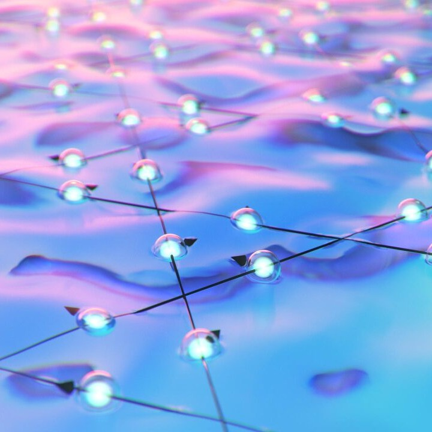

---
# Feel free to add content and custom Front Matter to this file.
# To modify the layout, see https://jekyllrb.com/docs/themes/#overriding-theme-defaults

layout: page
---

Hi! I am a theoretical condensed-matter physicist.
I am primarily interested in understanding exotic phenomena, such as *fractionalisation*, brought about by strong electronic correlations in materials.
I pursue this goal using analytical and computational techniques, including *neural quantum states* and other machine-learning tools.

Currently, I work as a postdoc at the [MPI-PKS](https://www.pks.mpg.de/) in Dresden.
I will start as an Ambizione fellow at the [University of Zürich](https://www.physik.uzh.ch/) in September.

<h3>Frustrated magnetism</h3>

